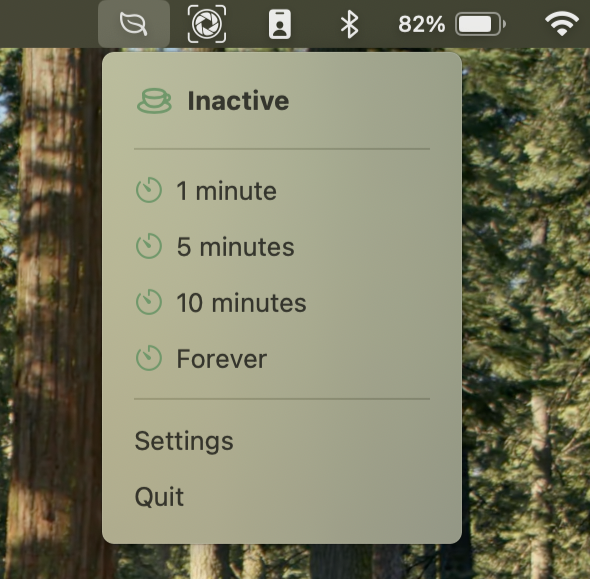
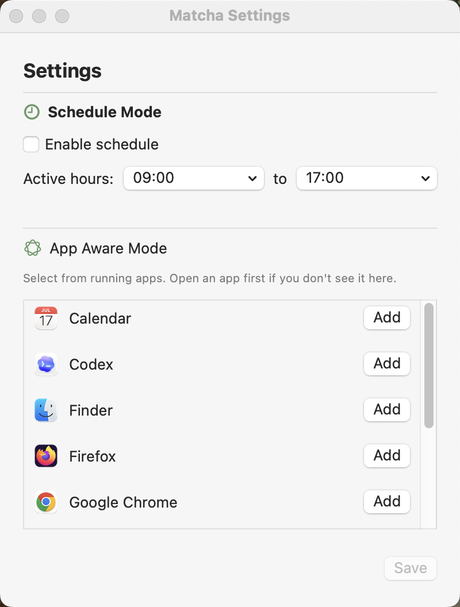

# Matcha

A lightweight macOS menu bar app that keeps your Mac awake only when you need it.

`Matcha` combines quick timers, scheduled hours, and app-aware triggers so your Mac stays active for focused work, meetings, downloads, or demos without leaving sleep prevention on forever.

## Highlights

- Menu bar first: start in one click from the status bar.
- Quick timers: `1 minute`, `5 minutes`, `10 minutes`, or `Forever`.
- Schedule mode: keep awake only within configured hours.
- App-aware mode: automatically stay awake while selected apps are running.
- Native notifications: alerts when a manual timer ends.
- No account, no cloud dependency, no telemetry in this project.

## Screenshots

| Menu | Settings |
|---|---|
|  |  |

| Active State |
|---|
|  |

## Requirements

- macOS `15.7+`
- Xcode `26.2+`
- Swift `5`

## Getting Started

1. Clone the repository:

   ```bash
   git clone https://github.com/<your-username>/Matcha.git
   cd Matcha
   ```

2. Open the project:

   ```bash
   open Matcha.xcodeproj
   ```

3. Build and run `Matcha` in Xcode.

## How It Works

1. Open the menu bar icon.
2. Choose a timer from the menu for quick manual control.
3. Open `Settings` to configure:
   - `Schedule Mode` (active hours)
   - `App Aware Mode` (bundle IDs from running apps)
4. Matcha creates a macOS power assertion while active, then releases it when inactive.

## Project Structure

```text
Matcha/
  Models/
  Services/
  ViewModels/
  Views/
  MatchaApp.swift
  AppDelegate.swift
```

## License

This project is licensed under the GNU General Public License v3.0.

See [LICENSE](LICENSE) for the full text.

## Contributing

Contributions are welcome.

1. Fork the repo.
2. Create a branch (`codex/your-feature` or `feature/your-feature`).
3. Commit your changes.
4. Open a pull request.

## Roadmap Ideas

- Launch at login option.
- More duration presets and custom timer input.
- Better active-state history/insights.
- Export/import settings.
